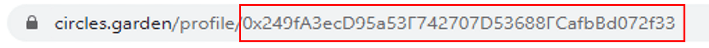
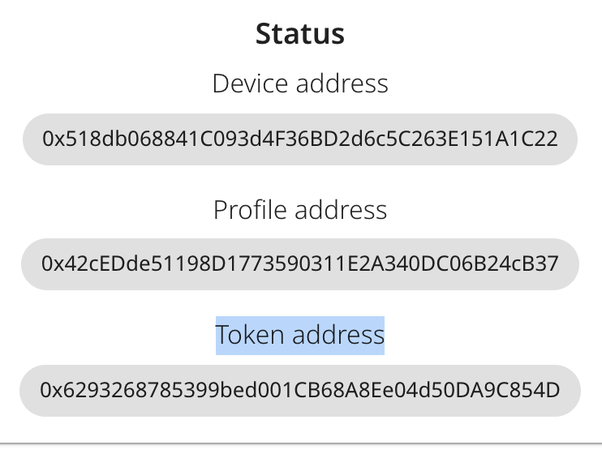
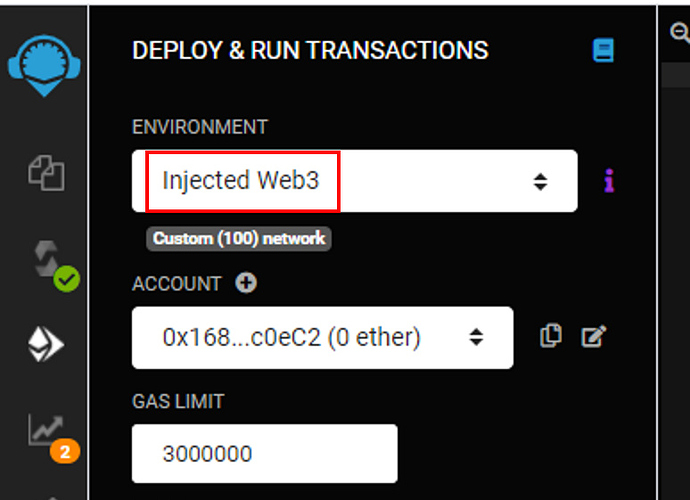

As the Relay Service is sometimes flaky, this guide shows how to mint UBI CRC directly by calling the smart contract from Remix IDE.

## Step-by-Step UBI Minting

_Note: For this to work you have to have xDai (less than $1) loaded in your MetaMask/Nifty wallet and switched to xDai Mainnet_

1. Get your circles.garden profile address ('Show Profile' / browser URL (https://circles.garden/profile/) / address after /profile/)
   

2. Note down the address shown in the URL of your browser, eg. https://circles.garden/profile/YOUR_PROFILE_ADDRESS it starts with “0x”
   

3. Go to [settings](https://circles.garden/settings) and note down the Token address
   

4. Open remix.ethereum.org
5. Create new file  `ICirclesToken.sol`  with content from [this gist](https://gist.github.com/ice09/9bc7319dbe877bbd5e4509f4198c5687).
6. Load contract at address of your CRC Token (make sure xDai Mainnet is active in wallet).
   

7. Call "look()" to see how much UBI you could claim.
8. Claim you UBI by calling function "update()".