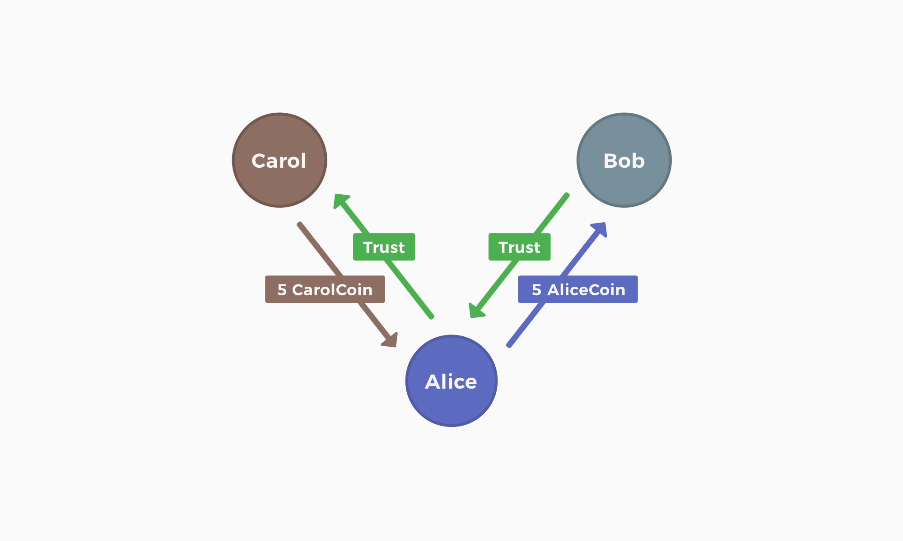
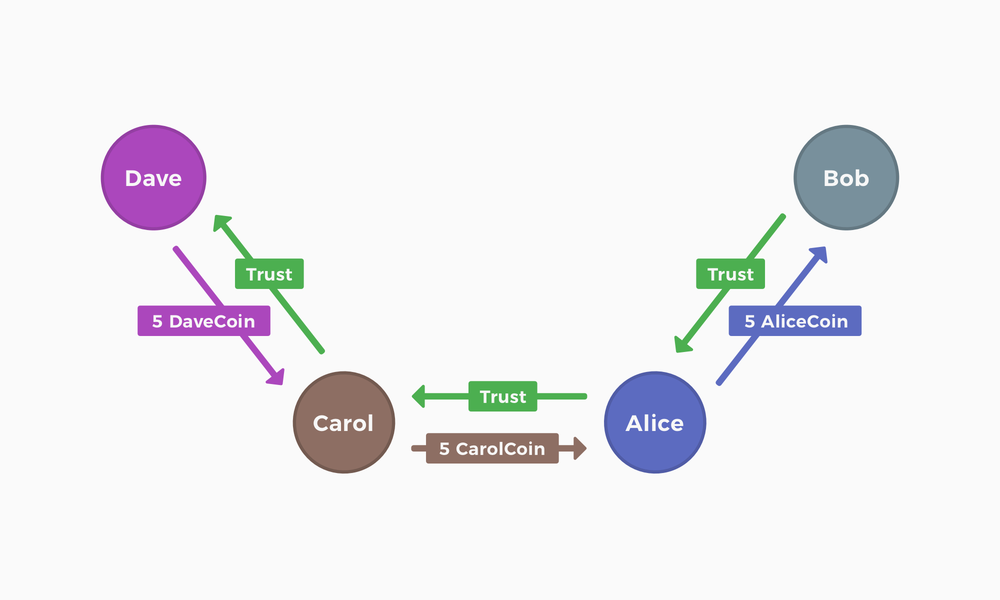
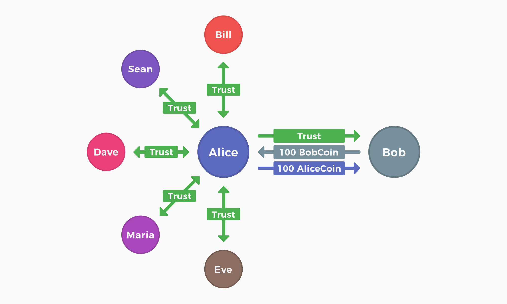
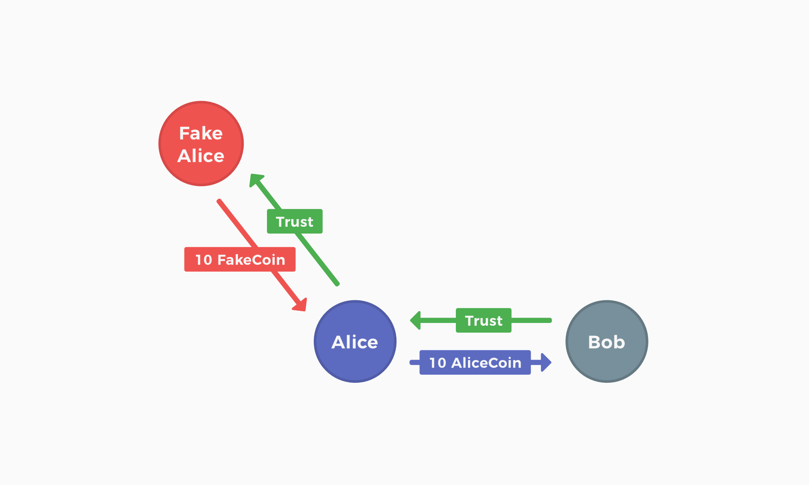

*Une plateforme de revenu universel décentralisée baséé sur des monnaies individuelles*

**https://joincircles.net**

## Résumé

Nous proposons un nouveau système monétaire appelé Circles qui est basé sur des crypto-monnaies individualisées et un graphe social de confiance entre ces monnaies. Ce système monétaire aura pour but de distribuer l'argent d'une manière qui, au fil du temps, conduira à l'égalisation des richesses et fonctionnera comme un revenu de base universel accessible dans le monde entier. Lorsque de nouveaux utilisateurs rejoignent Circles, une nouvelle crypto-monnaie personnelle leur est spécialement créée sur une blockchain compatible avec les contrats intelligents. Cette monnaie est ensuite régulièrement frappée et ajoutée à leur compte, formant la base des propriétés du Revenu Universel de Base Circles. Les utilisateurs ont la possibilité de faire confiance aux monnaies personnelles des autres utilisateurs, ce qui les oblige à traiter cette monnaie personnelle comme identique à toutes les autres monnaies Circles qu'ils détiennent. Au fur et à mesure que le graphe social s'interconnecte, ces monnaies personnelles convergent vers un seul système monétaire mondial.

## Introduction

Le Revenu Universel de Base est l'un des mouvements politiques de l'ère moderne qui suscite le plus d'intérêt dans toutes les cultures. Il a attiré le soutien de penseurs de tous horizons, dont Thomas Paine, Martin Luther King Jr, Stephen Hawking, Guy Standing, Milton Friedman et David Graeber. Il est considéré comme un projet utopique qui pourrait enfin libérer le potentiel créatif de tous les individus, l'aboutissement d'idéaux humanistes vieux de plusieurs siècles.

Le sujet de RUB a explosé en popularité ces dernières années, alors que les inégalités de richesse se creusent et que les salaires corrigés de l'inflation chutent partout dans le monde. Jusqu'à présent, les discussions ont été principalement vues à travers le prisme de la politique publique et de l'action bureaucratique. Le soutien du public à l'idée de RUB n'a jamais été aussi élevé, mais les plans de mise en œuvre progressent lentement et sans coopération à l'échelle internationale. Il semble que les systèmes de RUB aient reçu l'étiquette "trop gros pour être mis en œuvre" aux plus hauts niveaux de l'État, à l'instar de l'action sur le changement climatique, ce qui rend le développement et le déploiement peu probable dans un avenir proche.

L'introduction des réseaux mondiaux de blockchain change considérablement le débat sur l'RUB. Pour la première fois dans l'histoire, il est trivialement facile de créer des applications financières universellement accessibles à tout le monde sur Internet. Depuis le Bitcoin jusqu'aux plateformes de contrats intelligents comme Ethereum, la technologie blockchain est devenue très populaire en contournant les gardes et les obstacles qui rendent l'innovation si difficile dans le système financier traditionnel. Les contrats intelligents et la blockchain créent un environnement très prometteur pour la mise en œuvre d'un nouveau système RUB.

Circles se propose d'être le système monétaire RUB natif de la blockchain. Il intègre sa propre résistance aux attaques Sybil (c'est-à-dire aux faux comptes) et n'importe qui peut rejoindre le réseau à tout moment sans demander la permission de quiconque. Il a été conçu dans l'optique d'un démarrage complètement organique et populaire, mais il est extensible pour permettre à tout système de gouvernance arbitraire de fonctionner au-dessus du protocole de base. Circles est une façon entièrement nouvelle d'envisager la nature de l'argent et la signification de l'échange de valeurs dans un avenir post-RUB.

## Frappe de la monnaie

Circles est un système monétaire qui se compose de monnaies individuelles. Ces monnaies fonctionnent ensemble pour former un "tissu monétaire" unifié qui se comporte comme un Revenu Universel de Base .

Lorsqu'un nouveau compte blockchain rejoint Circles, le système crée et lui attribue une monnaie unique via un contrat intelligent. Il s'agit d'une _Monnaie personnelle_, et toutes les monnaies personnelles fonctionnent selon un ensemble de règles communes.

Chaque monnaie personnelle frappe continuellement de nouvelles pièces et les attribue à la personne qui lui est associée. De plus, la quantité de pièces frappées gonfle chaque année. C'est la seule façon de créer de l'argent frais dans les Circles et c'est la base de ses caractéristiques RUB. Toutes les monnaies frappent de nouvelles pièces au même rythme, ce qui signifie que de la nouvelle monnaie est coproduite et distribuée de manière égale à tous les membres du système à tout moment.

```
Alice rejoint le système et crée AliceCoin.
Les PersonalCoins sont tous frappés à un rythme de 1 par minute, par exemple.
Cinq minutes plus tard, Alice possède 5 AliceCoins et Bob rejoint le système, créant ainsi des BobCoins.
Cinq minutes plus tard, Alice a 10 AliceCoins et Bob a 5 BobCoins.
```

Il est important de noter que les nouvelles unités monétaires ne sont attribuées qu'à la personne associée à chaque monnaie personnelle :

```
Alice rejoint le système et crée AliceCoin.
Les PersonalCoins sont tous frappés à un rythme de 1 par minute.
Cinq minutes plus tard, Alice possède 5 AliceCoins et Bob rejoint le système, créant ainsi des BobCoins.
Alice transfère ses 5 AliceCoins à Bob
Alice a 0 PersonalCoins et Bob a 5 AliceCoins.
Cinq minutes plus tard, Alice a 5 AliceCoin et Bob a 5 AliceCoin et 5 BobCoin.
```

### Inflation

Afin de dissuader l'accumulation et d'encourager l'activité économique, le système introduira un calendrier annuel d'inflation. Il s'agit d'une surestarie par d'autres termes, où toutes les monnaies personnelles émettront des quantités progressivement plus importantes de jetons par an, payés à la seconde. Les nouveaux utilisateurs commenceront toujours à émettre à un taux qui est cohérent avec celui de toutes les autres monnaies personnelles.

```
Alice rejoint le système et crée AliceCoin.
Les PersonalCoins sont tous frappés au rythme de 1 par minute, et gonflent de 100 % toutes les cinq minutes.
Cinq minutes plus tard, Alice possède 5 AliceCoin et Bob rejoint le système, créant ainsi le BobCoin.
Alice transfère ses 5 AliceCoins à Bob
Alice a 0 PersonalCoin et Bob a 5 AliceCoin.
Cinq minutes plus tard, Alice a 5 AliceCoin et Bob a 5 AliceCoin et 5 BobCoin.
Alice a 5 pièces au total, et Bob a 10 pièces au total. La différence entre leurs portefeuilles est de 5 et Alice possède 0,5 (la moitié) du nombre de pièces que possède Bob.
Le taux d'émission gonfle de 100% et est maintenant de 2 pièces par minute.
Cinq minutes plus tard, Alice a 15 AliceCoin tandis que Bob a 5 AliceCoin et 15 BobCoin.
Au total, Alice possède 15 pièces et Bob 20 pièces. La différence entre leurs portefeuilles est toujours de 5, mais Alice possède maintenant 0,75 (trois quarts) du nombre de pièces que possède Bob. La différence relative entre leurs portefeuilles diminue.
```

## Une monnaie de confiance

Pour créer une monnaie utile, les utilisateurs doivent faire confiance aux monnaies des autres. La confiance est ce qui facilite les échanges dans le système. Lorsqu'un utilisateur fait confiance à une monnaie, il indique au système que celle-ci est équivalente à toutes les autres monnaies Circles qu'il possède déjà. Cela signifie que toute personne possédant cette monnaie de confiance peut automatiquement l'échanger contre l'une de vos monnaies Circles à un taux de change de un pour un.

```
Bob fait confiance à AliceCoin
Bob a 10 CarolCoin
Dave a 10 AliceCoin
Dave donne 5 AliceCoin à Bob et lui prend 5 CarolCoin.
```

Une autre façon de penser à la confiance est que l'utilisateur dit au système qu'il reconnaît des monnaies spécifiques comme "argent réel". Étant donné que n'importe quel compte de la blockchain peut rejoindre le système et commencer à frapper sa monnaie, une attaque triviale consiste à créer plusieurs comptes et à s'inscrire sur chacun d'eux pour obtenir plusieurs revenus de base. C'est ce qu'on appelle une attaque Sybil en termes de sécurité informatique. C'est grâce à l'existence de relations de confiance que les utilisateurs se protègent des faux comptes en précisant ceux dont ils savent pertinemment qu'ils représentent le compte principal d'un individu, formant ainsi une résistance Sybil native dans le système. Au niveau communautaire, la confiance dans le système signifie qu'il existe des ressources que l'on peut réclamer pour les Circles.

En raison du risque que n'importe quel compte devienne une sybille à tout moment, la confiance peut aussi toujours être révoquée. Si et quand la confiance est révoquée, la personne qui la révoque peut toujours dépenser les pièces de la personne à qui elle ne fait pas confiance, mais elle ne recevra pas de nouvelles pièces de cet utilisateur par le biais de transactions transitives.

Parce que la confiance est un moyen de se protéger de la contrefaçon des monnaies, il s'agit d'une responsabilité sérieuse de la part de l'utilisateur. Les utilisateurs devront s'appuyer fortement sur les connexions mutuelles lorsqu'ils établiront des relations de confiance directes de pair à pair, et les nouveaux utilisateurs sans connexions de confiance devront faire en sorte que leurs proches les plus proches soient leurs connexions initiales. Il est théoriquement possible d'augmenter la fongibilité et la facilité d'utilisation de Circles avec des services professionnels (validateurs) qui peuvent agir comme des courtiers de confiance, ou avec des monnaies de groupe mises en commun, qui peuvent appliquer leurs propres politiques d'adhésion, cependant, ces extensions possibles ne seront pas présentes dans la première itération du système des Circles. Nous vous invitons à poursuivre les recherches sur ce sujet.

### Échange transitif

Le fait de faire confiance à différentes monnaies crée une forme d'argent utile en raison de la nature transitive des réseaux sociaux. L'argent est utile lorsqu'il permet à de parfaits inconnus de faire des affaires de manière efficace. Lorsqu'un étranger veut envoyer de l'argent à un autre dans Circles, ils recherchent automatiquement une chaîne transitive de monnaies de confiance entre eux. Le payeur négocie alors le long de cette chaîne de monnaies de confiance, l'une après l'autre, jusqu'à ce qu'il obtienne une monnaie que le destinataire accepte.

```
Bob fait confiance à AliceCoin
Alice fait confiance à CarolCoin
Alice a 10 AliceCoin
Carol a 10 CarolCoin
Carol veut payer 5 PersonalCoins à Bob
Carol donne 5 CarolCoin à Alice et lui prend 5 AliceCoin.
Carol donne 5 AliceCoin à Bob
```



La transaction peut être étendue pour inclure également des chaînes de confiance à bonds multiples :

```
Bob fait confiance à AliceCoin
Alice fait confiance à CarolCoin
Carol fait confiance à DaveCoin
Alice a 10 AliceCoin
Carol a 10 CarolCoin
Dave a 10 DaveCoin
Dave veut payer 5 PersonalCoins à Bob
Dave donne 5 DaveCoin à Carol et lui prend 5 CarolCoin
Dave donne 5 CarolCoin à Alice et lui prend 5 AliceCoin
Dave donne 5 AliceCoin à Bob
```



Avec ce système, la connectivité du réseau social sert de mesure directe de la capacité des utilisateurs à effectuer des transactions entre eux. Une façon familière de penser à cela est le fameux phénomène des six degrés de séparation qui suggère que toute personne sur terre est reliée à toute autre par une chaîne de six personnes. Circles utilise ces chaînes pour effectuer des transactions dans le système. Si un utilisateur est bien intégré dans le réseau, avec de nombreuses connexions avec d'autres utilisateurs bien intégrés, il lui sera plus facile d'envoyer et de recevoir de la monnaie personnelle.

### Limites de confiance

Comme les monnaies personnelles ne peuvent voyager qu'à travers leurs réseaux de confiance, la fongibilité d'une monnaie personnelle spécifique est une mesure du nombre d'autres comptes qui lui font confiance et des ressources disponibles dans le réseau. Cela signifie que les nouveaux utilisateurs qui n'ont pas beaucoup de relations de confiance ont une monnaie moins fongible que quelqu'un qui est bien établi dans le réseau. Cela signifie également que la monnaie des nouveaux utilisateurs devient plus fongible au fil du temps, à mesure qu'ils créent des relations de confiance.

Puisque le système applique en interne un taux de change de un pour un, et que les monnaies personnelles des nouveaux utilisateurs sont moins fongibles que celles des utilisateurs établis, un problème potentiel émerge :

```
25 personnes font confiance à AliceCoin
Bob est nouveau, donc seule Alice fait confiance à BobCoin
Bob a 100 BobCoin
Alice a 100 AliceCoin
Bob donne 100 BobCoin à Alice et lui prend 100 AliceCoin.
Bob peut maintenant dépenser de l'argent avec 25 personnes (et leurs amis, et les amis de leurs amis, etc.).
Alice ne peut plus dépenser de l'argent qu'avec Bob
```



Dans l'exemple ci-dessus, Alice a besoin d'un moyen de reconnaître que BobCoin est de l'argent réel, tout en limitant son exposition à cet argent tant que Bob est encore nouveau. Circles y parvient grâce aux limites de confiance. Lorsque vous créez une relation de confiance dans Circles, vous avez la possibilité d'inclure le montant maximum de vos pièces totales que vous êtes prêt à détenir dans la monnaie d'un autre utilisateur. Une limite de confiance est exprimée en pourcentage. Avec les limites de confiance, Alice est en mesure d'aider Bob à s'intégrer dans le système d'une manière plus contrôlée :

```
25 personnes font confiance à AliceCoin
Bob est nouveau, donc seule Alice fait confiance à BobCoin.
Alice limite sa confiance à 10 BobCoin par mois.
Bob a 100 BobCoin
Alice a 100 AliceCoin
Bob donne 10 BobCoin à Alice et lui prend 10 AliceCoin.
Bob peut maintenant dépenser un dixième de son argent avec 25 personnes (et leurs amis, et les amis de leurs amis, etc.).
Alice met de côté ses 10 BobCoins pour les dépenser lorsque Bob aura noué d'autres relations de confiance.
Bob obtient que 10 personnes fassent confiance à BobCoin
Alice augmente sa limite de confiance dans le BobCoin à 100 par mois.
```

Les limites de confiance réduisent le risque de confier de nouveaux comptes au système, ce qui leur permet d'établir plus facilement des relations de confiance.

### Protections contre les faux comptes

Comme nous l'avons montré, les faux comptes sont une considération primordiale lors de la conception des protections dans le système. Puisque l'argent peut être dépensé indirectement par le biais de connexions transitives, montrons comment Circles se défend contre les faux comptes qui sont connectés à vos amis :

```
Bob fait confiance à AliceCoin
Alice crée un faux compte et fait confiance à FakeCoin
Alice a 10 AliceCoin
FakeAlice a 10 FakeCoin
Alice veut acheter quelque chose d'une valeur de 10 PersonalCoins à Bob en utilisant des FakeCoin.
FakeAlice donne 10 FakeCoin à Alice et lui prend 5 AliceCoin.
FakeAlice donne 10 AliceCoin à Bob.
```



Cet exemple montre que Bob ne peut recevoir que de l'argent auquel il fait confiance, et qu'Alice ne peut dépenser que de l'argent auquel d'autres utilisateurs font confiance à leur tour. Même si Alice crée 100 faux comptes et qu'ils se font tous confiance, elle ne pourra jamais dépenser plus que le montant d'AliceCoins dont elle dispose, puisque c'est le seul compte auquel les autres utilisateurs feront confiance. C'est pourquoi il est crucial que les utilisateurs prennent au sérieux les relations de confiance directes entre pairs.

## Une monnaie complémentaire

Circles n'a pas vocation à devenir la monnaie dominante dans le monde, qu'elle soit cryptographique ou autre. Il s'agit plutôt d'une monnaie complémentaire, travaillant en harmonie avec d'autres réserves de valeur et moyens d'échange, elle-même intégrée dans une diversité de monnaies. À l'avenir, les Circles pourraient même servir de monnaie forte et de fondation pour une monnaie de groupe plus flexible. Il s'agit d'une monnaie forte idéale car l'offre de monnaies individuelles spécifiques est parfaitement prévisible et le système global est hautement résilient car il ne dépend pas d'un fournisseur d'identité centralisé. Pour déterminer l'appartenance à un groupe, cette hypothétique monnaie de groupe pourrait fonctionner selon une logique commerciale arbitraire, par exemple en faisant partie d'un réseau de troc commercial, ou démocratiquement via des assemblées géographiquement limitées. Le groupe pourrait ensuite convertir de manière unidirectionnelle les monnaies personnelles de ses membres en une monnaie de groupe fongible à un taux de change dynamique qui répondrait aux besoins du groupe au fil du temps. Cela permettrait aux Circles d'agir comme un terrain d'expérimentation pour de nombreuses expériences différentes en matière de réalité (et de moralité) consensuelle, tout en offrant aux utilisateurs individuels la liberté de revenir aux monnaies personnelles si un groupe devient corrompu ou inutile. Les possibilités de nouvelles formes politiques sont nombreuses, mais le potentiel de systèmes de niveau 2 au-dessus du protocole de base est de loin l'aspect le plus spéculatif du projet et reste une question résolument ouverte pour des recherches ultérieures.

## Conclusion

Le système monétaire Circles a été conçu pour commencer à créer une économie RUB dès aujourd'hui. Nous pensons que la combinaison de la résilience et de l'accessibilité mondiale offerte par la technologie blockchain est un catalyseur clé qui rendra le revenu de base universel réalisable au cours de la prochaine génération. La résistance native de notre système aux attaques de type Sybil et son identité décentralisée intégrée en font un centre d'intérêt idéal pour les actions de terrain et l'organisation communautaire, qui ont été les caractéristiques des économies UBI envisagées au fil des ans. Nous étudions activement les implications économiques des différents compromis de conception de Circles dans le but de créer un système monétaire aussi utile et stable que possible. Notre feuille de route est conçue pour commencer à tester des applications dès que possible afin de voir comment cette nouvelle forme d'échange de valeurs se comporte dans des contextes économiques réels. Nous sommes très enthousiastes quant au potentiel de ce projet et espérons qu'il pourra servir de base essentielle à un nouveau paradigme économique dans les décennies à venir.
